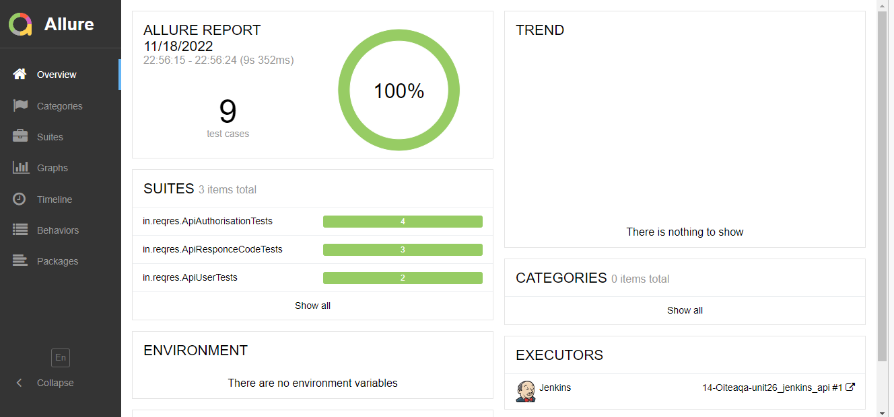
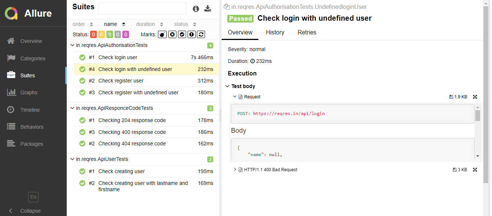

# Demonstration test automation project for Reqres.in


## Content

> ➠ [Covered functionality](#tshirt-covered-functionality)
>
> ➠ [Technology stack](#abacus-technology-stack)
>
> ➠ [Running tests from the terminal](#Running-tests-from-the-terminal)
>
> ➠ [Test results report in Allure Report](#scroll-main-page-of-allure-report)

## :tshirt: Covered functionality

> Autotests developed <code>API</code>.

### API

- [x] Check login user
- [x] Check login with undefined user
- [x] Check register user
- [x] Check register with undefined user
- [x] Checking 204 response code
- [x] Checking 400 response code
- [x] Checking 404 response code
- [x] Check creating user
- [x] Check creating user with lastname and firstname


## :abacus: Technology stack

<p align="center">


</p>

In this project, autotests are written in <code>Java</code> with <code>Selenide</code> and <code>Rest Assured</code> for API tests.

> <code>Owner</code> library provide test data.
>
> <code>Allure Report</code> generates a test run report.
> 
> <code>Gradle</code> is used for automated project build.
>
> <code>JUnit 5</code> is used as a unit testing library.
>
> <code>Jenkins</code> runs the tests.

## Running tests from the terminal

### :desktop_computer: Running Tests Locally

```
gradle clean test
```

### :desktop_computer: Remote test running

```
clean test
```
### :desktop_computer: Add file <code>data.properties</code> with data below
```
user.email=eve.holt@reqres.in
user.undefined.email=sample@mail.ru
user.undefined.password=1234
user.first.name=Janet
user.job=QA
user.lastname=Weaver
user.password=pistol
token=QpwL5tke4Pnpja7X4

```
### :scroll: Main page of <code>Allure-report</code>

<p align="center">

</p>

### :scroll: Suites page of <code>Allure-report</code>

<p align="center">

</p>

